# PeoplePay360 — AI-Powered HR & Payroll Automation Platform

> **EMAIL → AI → WORKFLOW → APPROVAL → AUTOMATION**


---

## 🚀 Overview

**PeoplePay360** is a unified HR and Payroll platform that connects employee master data, contracts, working schedules, attendance, time off, salary structures, payroll processing, and email automation into a single operational workflow. The platform's key differentiator is an **AI-powered email-to-workflow pipeline** where employees submit leave requests via natural-language email, which an AI system converts into validated HR workflows subject to human approval.

Instead of forcing employees to navigate complex forms for leave management, PeoplePay360 uses a natural-language email-to-workflow pipeline:

1. **Email Intake** ✉️ — Employee sends a leave email in natural language
2. **AI Classification & Extraction** 🤖 — AI identifies intent and extracts structured data (dates, type, reason)
3. **Validation** ✅ — Business rules check balances, overlaps, schedules, and policy rules
4. **Human Control** 🧑‍💼 — Pending requests are presented to HR managers for final approval/refusal
5. **Background Automation** ⚙️ — BullMQ + Redis queue sends notification emails asynchronously without blocking system processes

---

## 🏗️ System Architecture

The platform is composed of **six Docker services** orchestrated via Docker Compose:

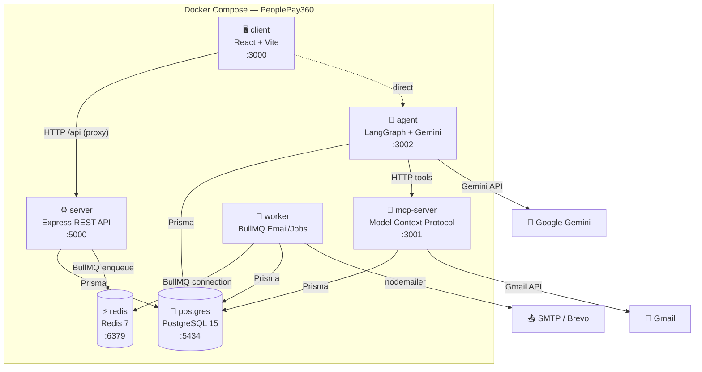

### Service Responsibilities

| Service | Port | Responsibility | Technology |
|---|---|---|---|
| **postgres** | 5434 | Persistent business data (single source of truth) | PostgreSQL 15 |
| **redis** | 6379 | Queue infrastructure for BullMQ workers | Redis 7 |
| **server** | 5000 | Main REST API, auth, business logic, payroll engine | Node.js + Express + Prisma |
| **mcp-server** | 3001 | Model Context Protocol — controlled AI tool interfaces | MCP SDK |
| **agent** | 3002 | Multi-agent AI orchestration & email workflow | LangGraph + Gemini |
| **worker** | — | Background async processing (email delivery, payslip jobs) | BullMQ |

---

## 🤖 Multi-Agent AI Architecture

PeoplePay360 leverages a specialized **five-agent framework** built with **LangGraph.js**, **LangChain.js**, and **Google Gemini**:

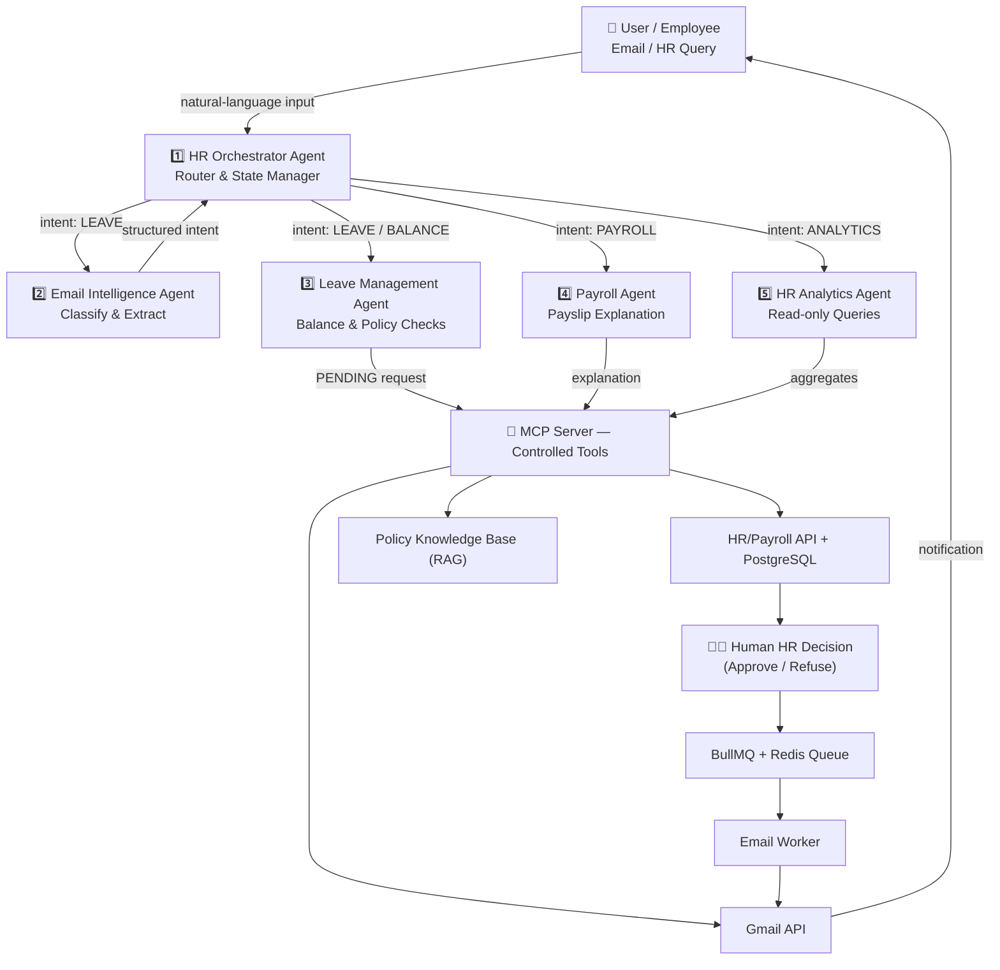

### Agent Roles

| # | Agent | Responsibility |
|---|---|---|
| 1 | **HR Orchestrator** | Central router and workflow state manager; detects intent, routes to the correct specialist, manages shared workflow state, decides between clarification and human review |
| 2 | **Email Intelligence** | Extracts structured leave intent from unstructured emails; classifies intent, extracts dates/type/reason, identifies employee, detects missing/ambiguous info, returns Zod-validated structured object |
| 3 | **Leave Management** | Validates requests against employee data, balances, schedules, and policies; creates `PENDING` leave requests — **cannot approve or refuse** |
| 4 | **Payroll Agent** | Explains payslips, compares periods, breaks down salary-rule contributions — reads existing calculations but never replaces the deterministic payroll engine |
| 5 | **HR Analytics** | Executes safe, read-only aggregate queries over live database stats and produces concise natural-language answers |

### Intent Catalog

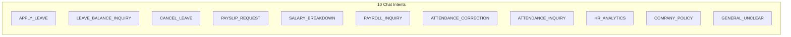

---

## 📧 Email → Leave Workflow

The end-to-end pipeline that moves a leave request from an employee's inbox through AI processing to HR approval and automated notification:

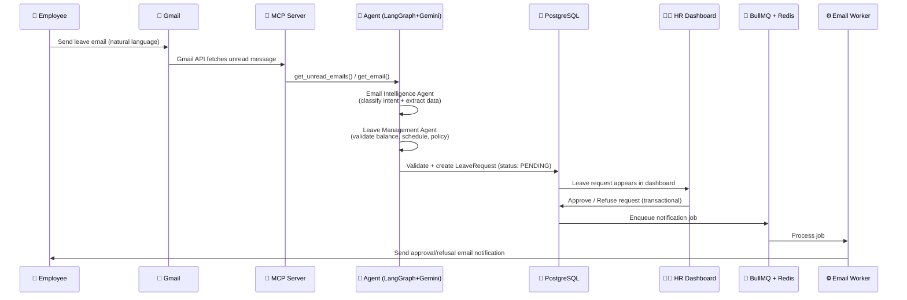

---

## 💰 Payroll Processing

The deterministic payroll engine processes payruns through an explicit state machine:

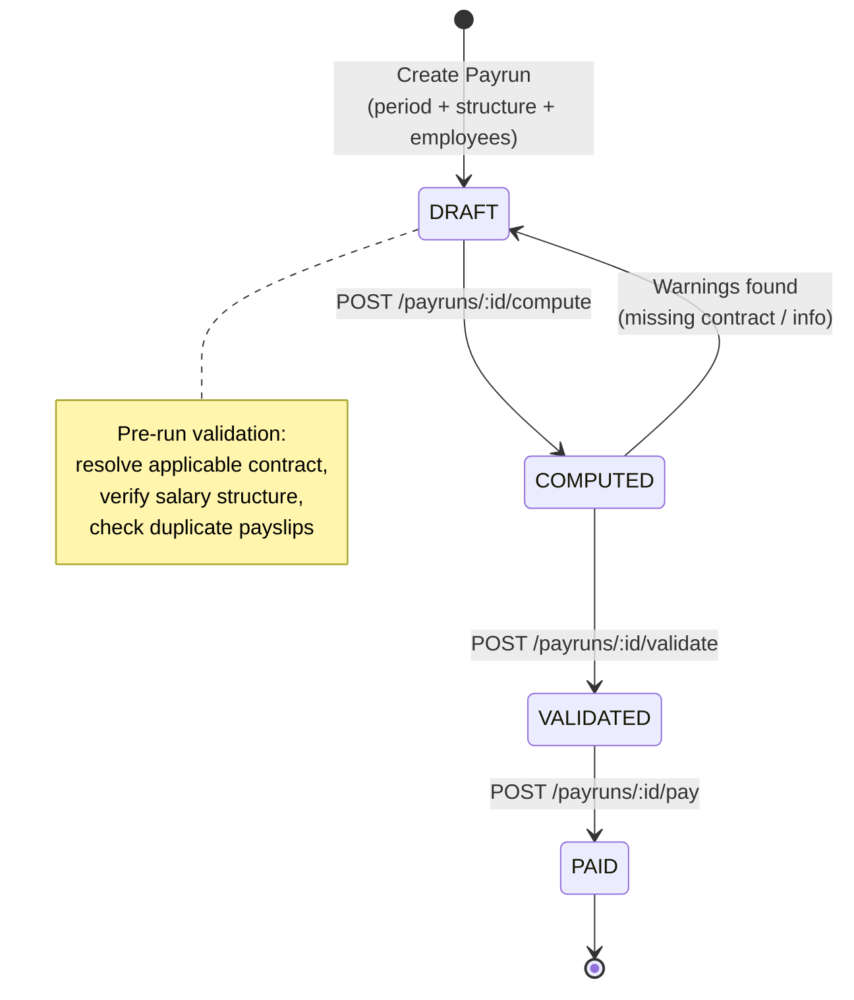

### Salary Rule Engine

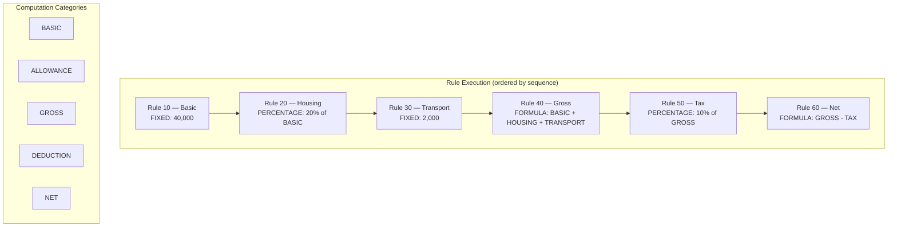

### Payroll End-to-End

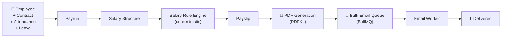

---

## 🗄️ Database Schema

The PostgreSQL schema (Prisma ORM) contains **22 models**. The central entity is `Employee`, which connects HR core, attendance, time off, and payroll:

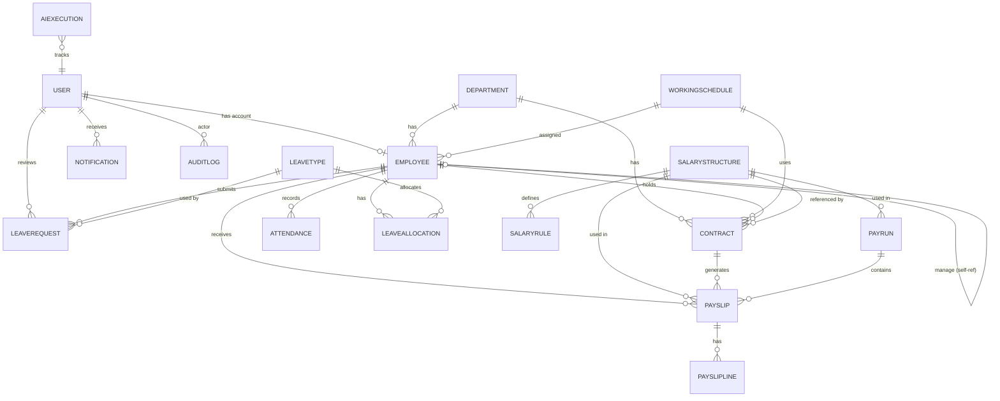

### Key Enumerations

| Domain | Values |
|---|---|
| **Roles** | `EMPLOYEE`, `HR_MANAGER`, `HR_PAYROLL_USER`, `HR_PAYROLL_MANAGER`, `ADMIN` |
| **Leave Status** | `PENDING`, `APPROVED`, `REFUSED`, `CANCELLED` |
| **Leave Source** | `MANUAL`, `EMAIL_AI` |
| **Payrun Status** | `DRAFT`, `COMPUTED`, `VALIDATED`, `PAID` |
| **Payslip Status** | `DRAFT`, `COMPUTED`, `VERIFIED`, `PAID` |
| **Rule Category** | `BASIC`, `ALLOWANCE`, `GROSS`, `DEDUCTION`, `NET` |
| **Computation** | `FIXED`, `PERCENTAGE`, `FORMULA` |
| **AI Execution** | `SUCCESS`, `FAILED`, `NEEDS_CLARIFICATION`, `HUMAN_REVIEW` |

---

## 🔐 Security Architecture

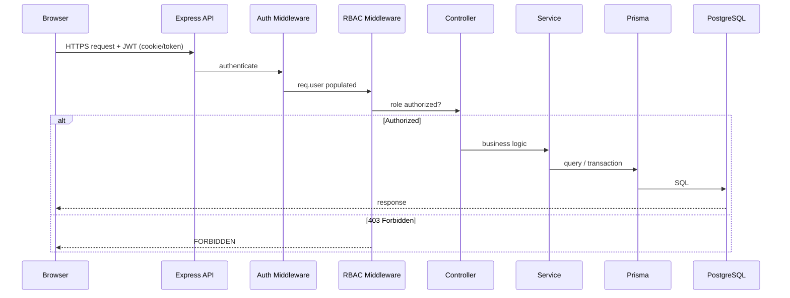

### Design Principles

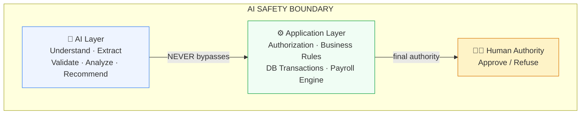

1. **AI is assistive, not authoritative** — AI extracts/validates but never approves; humans make the final HR decision.
2. **PostgreSQL is the single source of truth** — AI output is not persisted as truth until it passes application validation.
3. **Background work is asynchronous** — email sending and bulk operations go through BullMQ/Redis queues.
4. **Business rules live in application logic** — contracts, leave allocations, and salary rules are deterministic backend services.
5. **AI Safety Boundary** — the AI reasoning layer is separated from authoritative transactions (authorization, business rules, DB transactions, human approval).

---

## 🛠️ Technology Stack

| Layer | Technology |
|---|---|
| **Frontend** | React 18 · Vite 5 · TypeScript · Tailwind CSS · React Router · Framer Motion · Recharts · lucide-react |
| **Backend** | Node.js 20 · Express 4 · Prisma ORM 5 · Zod 3 · JWT · bcryptjs · helmet · express-rate-limit |
| **Database** | PostgreSQL 15 (local) · Neon PostgreSQL w/ pgvector (remote RAG) |
| **AI Layer** | LangGraph.js · LangChain.js · Google Gemini 2.0 (`@google/generative-ai`) |
| **Integrations** | MCP (`@modelcontextprotocol/sdk`) · Gmail API |
| **Queue & Workers** | BullMQ 5 · ioredis · Redis 7 |
| **PDF** | PDFKit |
| **Docs** | Swagger/OpenAPI |
| **Infrastructure** | Docker · Docker Compose · Git/GitHub |

---

## 📂 Project Structure

```text
.
├── agent/                      # Multi-Agent Orchestration Layer (LangGraph + Gemini)
│   ├── src/
│   │   ├── agents/             # HROrchestratorAgent.js (working leave-email workflow)
│   │   ├── nodes/              # Email, leave, payroll, analytics agent nodes
│   │   ├── core/               # LangGraph state, graph builder, memory
│   │   ├── prompts/            # LLM prompt templates
│   │   ├── schemas/            # Zod validation schemas
│   │   ├── tools/              # Leave/payroll/analytics DB tools
│   │   └── rag/                # RAG policy knowledge base (+ pgvector retriever)
│   ├── intents.json            # Intent catalog (10 intent types)
│   └── intents.ts              # Intent matching helpers
│
├── client/                     # Frontend React + Vite + Tailwind app (:3000)
│   └── src/
│       ├── api/                # REST API client
│       ├── components/         # UI components & layout
│       ├── context/            # Auth context
│       ├── features/           # auth, dashboard, employees, contracts,
│       │                       # schedules, attendance, leave, payroll, admin
│       └── routes/             # App routes
│
├── docs/                       # Architecture & PRD documentation
│   ├── PeoplePay360_Solution_MultiAgent.md
│   ├── PeoplePay360_PRD_MultiAgent.md
│   └── PeoplePay360_Entire_MultiAgent_Workflow.docx
│
├── mcp-server/                 # Model Context Protocol Server (:3001)
│   └── src/
│       ├── index.js            # Express server, GET /tools, POST /tools/:name
│       └── tools/index.js      # 4 MCP tools (emails, employee, leave balance, leave request)
│
├── server/                     # Backend REST API & Database Services (:5000)
│   ├── prisma/
│   │   ├── schema.prisma       # 22-model DB schema
│   │   └── seed.js             # Demo data (roles, departments, employees, salary rules)
│   └── src/
│       ├── modules/            # auth, departments, employees, contracts, schedules,
│       │                       # attendance, timeOff, payroll, dashboard, email
│       ├── services/           # payrollEngine, leaveService, pdfService, etc.
│       ├── middleware/         # auth, rbac, validate, error middleware
│       ├── schemas/            # Zod validation schemas
│       ├── utils/              # apiResponse, jwt, logger, email, constants
│       └── docs/swagger.json   # OpenAPI spec
│
└── worker/                     # Asynchronous Background Processing Workers
    └── src/
        └── queues/             # emailWorker.js (emailQueue + payslipQueue)
```

---

## 🚦 Prerequisites

- [Node.js](https://nodejs.org) **20+**
- [Docker](https://www.docker.com/products/docker-desktop) & Docker Compose
- [Google Gemini API key](https://ai.google.dev/) (for AI features)
- Optional: Gmail API credentials / Brevo SMTP for email features

---

## ⚡ Quick Start

### 1. Clone & Install Dependencies

```bash
git clone https://github.com/your-org/team_49_odoo_grand_final_hackathon.git
cd team_49_odoo_grand_final_hackathon

# Install each service's dependencies
cd server && npm install && cd ..
cd client && npm install && cd ..
cd agent && npm install && cd ..
cd mcp-server && npm install && cd ..
cd worker && npm install && cd ..
```

### 2. Configure Server

```bash
cd server
cp .env.example .env
# Edit .env with your DATABASE_URL, JWT_SECRET, GEMINI_API_KEY, etc.
```

### 3. Run with Docker Compose

```bash
docker compose up --build
```

This starts all six services: **PostgreSQL, Redis, Server, MCP Server, Agent, and Worker**.

### 4. Seed the Database

```bash
cd server
npx prisma migrate dev
npm run seed
```

### 5. Run the Frontend (development)

```bash
cd client
npm run dev
```

Access the app at **http://localhost:3000**.

---

## 🔧 Running Services Individually

| Service | Directory | Command |
|---|---|---|
| **Server** | `server/` | `npm run dev` (port 5000) |
| **Client** | `client/` | `npm run dev` (port 3000) |
| **MCP Server** | `mcp-server/` | `npm run dev` (port 3001) |
| **Agent** | `agent/` | `npm run dev` (port 3002) |
| **Worker** | `worker/` | `npm run dev` |

---

## 🌍 Environment Variables

| Variable | Required | Default | Description |
|---|---|---|---|
| `DATABASE_URL` | ✅ Yes | — | PostgreSQL / Prisma connection string |
| `NODE_ENV` | No | `development` | `development` \| `production` \| `test` |
| `PORT` | No | `5000` | Server port |
| `JWT_SECRET` | No | `super-secret-key-...` | JWT signing secret |
| `JWT_EXPIRES_IN` | No | `7d` | JWT token lifetime |
| `REDIS_HOST` | No | `localhost` | Redis host |
| `REDIS_PORT` | No | `6379` | Redis port |
| `GEMINI_API_KEY` | No | — | Google Gemini API key |
| `FRONTEND_URL` | No | `http://localhost:5173` | Allowed CORS origin |

> **⚠️ Security:** Never commit real secrets. `.env` files are git-ignored. Use separate values for local development vs. production.

---

## 📡 API Reference

All module routes are mounted under `/api`. Swagger UI is available at `GET /api/docs`.

### Auth (`/api/auth`)

| Method | Path | Access | Description |
|---|---|---|---|
| POST | `/auth/register` | Public | Register a user |
| POST | `/auth/login` | Public | Login |
| POST | `/auth/logout` | Public | Logout |
| GET | `/auth/me` | Authenticated | Current user |
| POST | `/auth/forgot-password` | Public | Request password reset |
| POST | `/auth/reset-password` | Public | Reset password |
| POST | `/auth/users` | `ADMIN` | Create user |
| GET | `/auth/users` | `ADMIN` | List users |

### Departments (`/api/departments`)

| Method | Path | Access | Description |
|---|---|---|---|
| GET | `/departments` | Authenticated | List departments |
| GET | `/departments/:id` | Authenticated | Get department |
| POST | `/departments` | `ADMIN`, `HR_MANAGER` | Create department |
| PATCH | `/departments/:id` | `ADMIN`, `HR_MANAGER` | Update department |
| DELETE | `/departments/:id` | `ADMIN`, `HR_MANAGER` | Delete department |

### Employees (`/api/employees`)

| Method | Path | Access | Description |
|---|---|---|---|
| GET | `/employees` | HR roles | List employees |
| GET | `/employees/:id` | Authenticated | Get employee |
| POST | `/employees` | `ADMIN`, `HR_MANAGER` | Create employee |
| PATCH | `/employees/:id` | `ADMIN`, `HR_MANAGER` | Update employee |
| DELETE | `/employees/:id` | `ADMIN`, `HR_MANAGER` | Delete employee |

### Contracts (`/api/contracts`)

| Method | Path | Access | Description |
|---|---|---|---|
| GET | `/contracts` | HR roles | List contracts |
| GET | `/contracts/:id` | HR roles | Get contract |
| POST | `/contracts` | `ADMIN`, `HR_MANAGER`, `HR_PAYROLL_MANAGER` | Create contract |
| PATCH | `/contracts/:id` | `ADMIN`, `HR_MANAGER`, `HR_PAYROLL_MANAGER` | Update contract |
| DELETE | `/contracts/:id` | `ADMIN`, `HR_MANAGER` | Delete contract |

### Schedules (`/api/schedules`)

| Method | Path | Access | Description |
|---|---|---|---|
| GET | `/schedules` | Authenticated | List working schedules |
| GET | `/schedules/:id` | Authenticated | Get schedule |
| POST | `/schedules` | `ADMIN`, `HR_MANAGER` | Create schedule |
| PATCH | `/schedules/:id` | `ADMIN`, `HR_MANAGER` | Update schedule |
| DELETE | `/schedules/:id` | `ADMIN`, `HR_MANAGER` | Delete schedule |

### Attendance (`/api/attendance`)

| Method | Path | Access | Description |
|---|---|---|---|
| POST | `/attendance/check-in` | Authenticated | Check in |
| POST | `/attendance/check-out` | Authenticated | Check out |
| GET | `/attendance` | Authenticated | List attendance records |
| GET | `/attendance/:id` | Authenticated | Get attendance |
| PATCH | `/attendance/:id` | `ADMIN`, `HR_MANAGER` | Correct attendance |

### Time Off (`/api/time-off`)

| Method | Path | Access | Description |
|---|---|---|---|
| GET | `/time-off/types` | Authenticated | List leave types |
| POST | `/time-off/types` | `ADMIN`, `HR_MANAGER` | Create leave type |
| GET | `/time-off/allocations` | Authenticated | List allocations |
| POST | `/time-off/allocations` | `ADMIN`, `HR_MANAGER` | Create allocation |
| GET | `/time-off/employees/:employeeId/balance` | Authenticated | Get balance |
| POST | `/time-off/requests` | Authenticated | Create leave request |
| GET | `/time-off/requests` | Authenticated | List leave requests |
| POST | `/time-off/requests/:id/approve` | `ADMIN`, `HR_MANAGER` | Approve request |
| POST | `/time-off/requests/:id/refuse` | `ADMIN`, `HR_MANAGER` | Refuse request |
| POST | `/time-off/requests/:id/cancel` | Authenticated | Cancel request |

### Payroll (`/api/payroll`)

| Method | Path | Access | Description |
|---|---|---|---|
| GET | `/payroll/structures` | HR roles | List salary structures |
| POST | `/payroll/structures` | `ADMIN`, `HR_PAYROLL_MANAGER` | Create structure |
| GET | `/payroll/payruns` | HR roles | List payruns |
| POST | `/payroll/payruns` | `ADMIN`, `HR_PAYROLL_MANAGER` | Create payrun |
| POST | `/payroll/payruns/:id/compute` | `ADMIN`, `HR_PAYROLL_MANAGER` | Compute payrun |
| POST | `/payroll/payruns/:id/validate` | `ADMIN`, `HR_PAYROLL_MANAGER` | Validate payrun |
| POST | `/payroll/payruns/:id/pay` | `ADMIN`, `HR_PAYROLL_MANAGER` | Mark payrun paid |
| GET | `/payroll/payslips` | Authenticated | List payslips |
| GET | `/payroll/payslips/:id/pdf` | Authenticated | Download payslip PDF |

### Dashboard (`/api/dashboard`)

| Method | Path | Access | Description |
|---|---|---|---|
| GET | `/dashboard/overview` | HR roles | Overview KPIs |
| GET | `/dashboard/payroll` | HR roles | Payroll metrics |
| GET | `/dashboard/attendance` | HR roles | Attendance metrics |
| GET | `/dashboard/time-off` | HR roles | Time-off metrics |

### Email & Health

| Method | Path | Access | Description |
|---|---|---|---|
| POST | `/email/inbound` | Public | Inbound email webhook |
| GET | `/health` | Public | Server + PostgreSQL health check |

> **Agent service (port 3002):** `POST /agent/process-email`
> **MCP server (port 3001):** `GET /tools`, `POST /tools/:name`

---

## 🔑 Role-Based Access Control (RBAC)

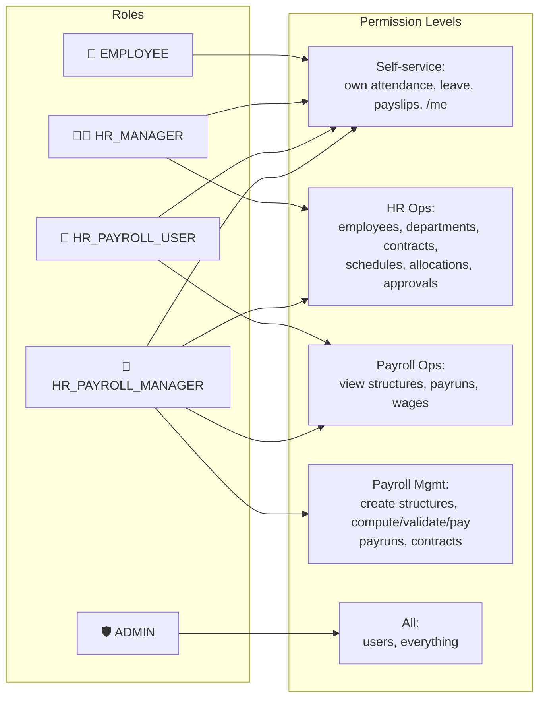

---

## 📖 Documentation

Detailed specification and architecture documents are available in the [docs](docs/) directory:

- [PeoplePay360 Solution Document](docs/PeoplePay360_Solution_MultiAgent.md) — Full architecture, workflows, and design decisions
- [PeoplePay360 PRD](docs/PeoplePay360_PRD_MultiAgent.md) — Product requirements
- [Multi-Agent Workflow Overview](docs/PeoplePay360_Entire_MultiAgent_Workflow.docx) — Visual workflow diagram
- [Agent Module Readme](agent/README.md) — Multi-agent & RAG architecture detail
- [Swagger API Docs](server/src/docs/swagger.json) — OpenAPI specification

---

## 🎬 5-Minute Hackathon Demo Walkthrough

**Minute 0–1 — Product:** Show the dashboard, employee records, leave management, and payroll screens. Explain: *"PeoplePay360 connects HR and payroll operations while turning employee emails into actionable workflows."*

**Minute 1–2 — AI Leave:** Send an email like *"I need leave from 10 September to 12 September for a family function"* and show the request appearing as **pending**.

**Minute 2–3 — Human Approval:** Open the request, verify the extracted fields (employee, dates, type, reason, balance), and click **APPROVE**. Show the balance update.

**Minute 3–4 — Automation:** Show the BullMQ → Worker → Email flow, the employee notification, and the email log entry.

**Minute 4–5 — Payroll:** Create a payrun → show period, contract, salary structure, salary rules, payslip, PDF download, and bulk email delivery.

Finish with:

> **EMAIL → AI → WORKFLOW → APPROVAL → AUTOMATION**

---

## 🤝 Contributing

1. Fork the repository.
2. Create a feature branch: `git checkout -b feature/your-feature`
3. Commit your changes: `git commit -m "Add your feature"`
4. Push to the branch: `git push origin feature/your-feature`
5. Open a Pull Request.

---

## 📜 License

**MIT** © Team 49 — Odoo Grand Final Hackathon

---

*Built with ❤️ by **Team 49** — PeoplePay360 · `EMAIL → AI → WORKFLOW → APPROVAL → AUTOMATION`*
