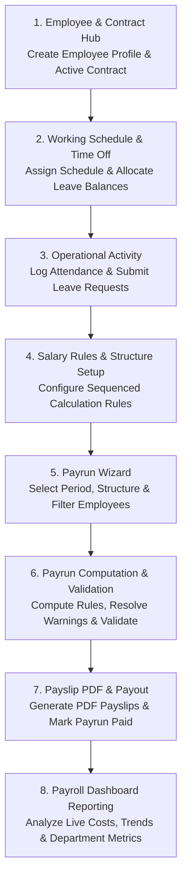
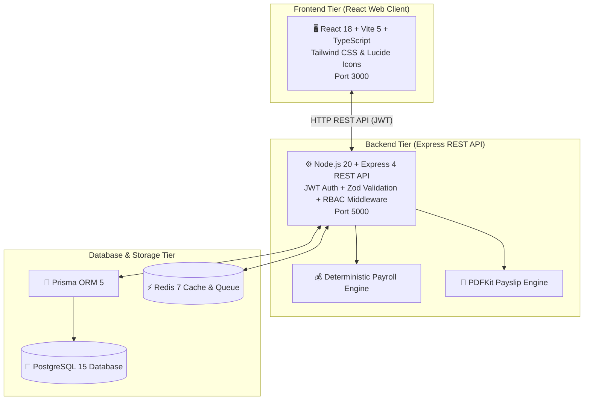
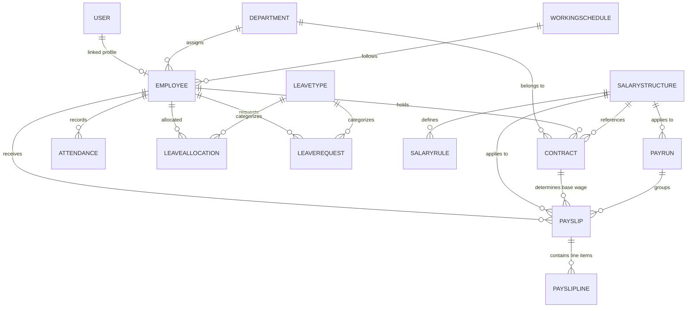

# PeoplePay360: HR & Payroll

> **An Integrated Human Resource and Payroll Operations Platform**
> 
> *Developed for the Odoo Grand Final Hackathon by Team 49*


---

## 📌 1) Project Overview

Many basic HR tools store employee details, attendance, leave, and salary data as separate records. Real HR and payroll teams need these records to work together seamlessly.

**PeoplePay360: HR & Payroll** goes beyond simple employee CRUD screens to create a connected operational flow. The **Employee record** acts as the central hub:
- Related **Contracts** and **Working Schedules** provide active payroll context.
- **Attendance** and **Time Off** capture day-to-day HR activity.
- **Salary Structures** and **Salary Rules** define deterministic salary computation logic.
- **Payruns** transform eligible employee records into validated payslips that can be printed as PDF documents and distributed to employees.

---

## 🎯 2) Goals & Scope

### Main Goal
Develop an integrated HR and payroll platform managing the full employee lifecycle—from master data and time tracking to payroll calculation, PDF payslip generation, and reporting.

### Key Outcomes
- **Unified HR Flow**: Centralized employee records with smart-button navigation to Contracts, Attendance, Time Off, and Allocations.
- **Contract Management**: Maintain historical contract records while ensuring payroll strictly processes the active, period-specific contract without concurrent overlap.
- **Operational Tracking**: Flexible Working Schedules with dynamic weekly hours calculation, attendance tracking (with exception handling & corrections), and comprehensive Time Off management.
- **Payroll Processing**: A two-step pay run creation wizard (Scope/Period selection $\rightarrow$ Employee selection), automated salary rule execution, validation warning detection, and payrun state machine lifecycle.
- **Reporting & Analytics**: Centralized Payroll Dashboard aggregating real-time HR and Payroll data across Periods, Departments, and Employee Types.

---

## 👤 3) User Roles & Access Control Matrix

The platform enforces Role-Based Access Control (RBAC) across 5 granular user roles:

| Role | Core Access & Permissions |
|---|---|
| **Employee** | View own profile details, personal attendance logs, and leave balances. Submit attendance entries and Time Off Requests. No payroll or administrative access. |
| **HR Manager** | Full CRUD access to Employees, Attendance, Contracts, Working Schedules, and Time Off modules. Approve or refuse Time Off Requests. No access to payroll processing features. |
| **HR Payroll User** | All HR Manager permissions plus Create, Read, and Update access to Payruns and Payslips. Read-only access to Salary Structures and Salary Rules. |
| **HR Payroll Manager** | All HR Payroll User permissions with full CRUD control over Payruns, Payslips, Salary Structures, and Salary Rules. Full control over HR and payroll configurations. |
| **Admin** | Unrestricted access across all platform modules, system settings, role assignments, and user management. |

---

## 🧩 4) Modules & Feature Breakdown

### A) HR Backend (Configuration & Master Data Area)

#### A1) Employee Master Management
- Support for **Kanban**, **List**, and **Form** views for employee records.
- Capture essential employment details: Department, Manager, Working Schedule, Job Position, Employee Number, and Active Status.
- Smart-button direct links on the employee form to filter and view related Contracts, Attendance, Time Off, and Allocations.

#### A2) Contract Management
- Maintain historical contract records linked to employees to track wage and position changes over time.
- Clear highlight of active contracts in list and form views.
- Capture contract duration, dates, wage, wage type, position, department, working schedule, and salary structure.
- Strict period boundary validation to ensure payroll processes only the contract applicable to the selected period.

#### A3) Working Schedule Setup
- Define weekly working patterns using Day, Start Time, End Time, and Break Duration.
- **Automated Hours Calculation**: Automatically computes net daily hours ($\le 24$ hrs/day constraint) and total weekly hours.
- Link schedules to employees and contracts to standardize attendance and payroll expectations.

#### A4) Time Off Type & Allocation Setup
- Configure Time Off Types with specific units (Days/Hours), allocation requirements, approval workflows, and payroll integration.
- Manage Leave Allocations for employees requiring approval before balances become available.
- **Automated Balance Consumption**: Approved leave requests automatically deduct from assigned leave allocations.

#### A5) Salary Structure Setup
- Containers for organized collections of Salary Rules (e.g., *"Regular Salary Structure"*).
- Manage included salary rules and their execution sequence.
- Dictates the specific set of rules applied to calculate employee payslips during payruns.

#### A6) Salary Rule Setup
- Attribute management: Name, Code, Category, and Execution Sequence.
- **Categories**: `BASIC`, `ALLOWANCE`, `GROSS`, `DEDUCTION`, `CONTRIBUTION`, and `NET`.
- **Computation Methods**:
  - `FIXED`: Fixed monetary values.
  - `PERCENTAGE`: Percentage of a base category or component (e.g., 20% of `BASIC`).
  - `FORMULA`: Custom formula calculations building upon earlier rule totals.

#### A7) Reporting & Dashboard Configuration
- Real-time aggregation of live system records across HR and Payroll modules.
- Multi-dimensional filtering by Period, Department, and Employee Type.

---

### B) HR & Payroll Frontend (Operational Experience)

#### B1) Main Navigation & Employee Hub
- Top navigation bar providing access to **Employees**, **Contracts**, **Attendance**, **Time Off**, **Payroll**, and **Reports**.
- Kanban and List views leading into the unified Employee Form.

#### B2) Employee Form & Smart-Button Navigation
- Centralized employee identity card displaying role, manager, schedule, and active status.
- Smart-buttons displaying real-time counter badges for linked Contracts, Attendance, Time Off, and Allocations.

#### B3) Attendance Management
- Accessible globally from the main navigation or directly from an individual Employee Form.
- List view displaying Check-In, Check-Out, Worked Hours, and Attendance Status (`PRESENT`, `HALF_DAY`, `ABSENT`, `OVERTIME`).
- Attendance correction modal supporting manual adjustment with audit reasons (restricted to authorized HR users).

#### B4) Time Off Requests & Approvals
- Request overview tracking Employee, Type, Date Range, Duration, and Status (`PENDING`, `APPROVED`, `REFUSED`).
- Approval/Refusal workflow that automatically updates leave allocation balances upon approval.

#### B5) Two-Step Payrun Creation Wizard
- **Step 1 (Scope & Period)**: Select Payrun Name, Period Start, Period End, and Salary Structure.
- **Step 2 (Employee Selection)**: Filter and select eligible staff members before batch initialization.

#### B6) Payrun Processing & Lifecycle State Machine
- Lifecycle states: `DRAFT` $\rightarrow$ `COMPUTED` $\rightarrow$ `VALIDATED` $\rightarrow$ `PAID`.
- Processing actions: **Compute Salary**, **Validate Payrun**, **Mark as Paid**, and **Send Payslips**.
- Real-time pre-finalization warnings (e.g., missing bank details, duplicate payslips, or unverified contracts).

#### B7) Payslip & Salary Computation View
- Detailed breakdown of individual payslips displaying Employee details, Payrun Period, Worked Days, and contract wage.
- Itemized salary computation table rendering rule execution lines (`BASIC` $\rightarrow$ `ALLOWANCES` $\rightarrow$ `GROSS` $\rightarrow$ `DEDUCTIONS` $\rightarrow$ `NET`).

#### B8) Payslip PDF Generation & Employee Delivery
- Server-side printable **PDF Payslip Generation** via PDFKit.
- One-click bulk PDF distribution and email delivery for finalized payruns.

#### B9) Payroll Dashboard
- **KPI Metrics Cards**: Total Net Salary Paid, Payslips Generated, Average Salary, Approved Time Off, and Attendance Health.
- **Interactive Analytics Charts**: Salary Cost Breakdown by Department and Monthly Net Salary Trends.
- **Operational Alerts**: Unresolved attendance exceptions, contract expiration items, missing bank details, and pending leave requests.

---

## 🔁 5) Complete End-to-End Flow



1. **Employee Setup**: Employees are created and managed via unified Kanban or List views acting as the central hub.
2. **Contract & Schedule Alignment**: Contracts and Working Schedules are linked to employees to establish active wage terms and expected working hours for the period.
3. **Daily Operational Tracking**: Attendance entries record check-in/out times, worked hours, and exceptions. Leave requests consume allocated leave balances upon manager approval.
4. **Payroll Configuration**: Salary Structures sequence Salary Rules to dictate exact net salary computation pipelines.
5. **Payrun Wizard Execution**: Payroll officers launch a Payrun via the two-step wizard, defining period bounds and selecting target employees.
6. **Computation & Error Verification**: The system evaluates salary rules per employee, checking for warnings (e.g., missing details or duplicate records) prior to validation.
7. **Finalization & PDF Delivery**: Validated payruns are marked `PAID`, generating printable PDF payslips for distribution.
8. **Dashboard Analytics**: Real-time KPI cards, expenditure charts, and operational alerts synthesize live data across all HR and Payroll modules.

---

## 🏗️ 6) System Architecture & Tech Stack



### Component Breakdown

| Layer | Technology | Function |
|---|---|---|
| **Frontend** | React 18, Vite 5, TypeScript, Tailwind CSS, Lucide Icons | Responsive HR & Payroll UI, Kanban/List views, Payrun Wizard, Dashboard analytics |
| **Backend API** | Node.js 20, Express 4, Prisma ORM 5, Zod | REST API endpoints, RBAC middleware, contract validation, attendance calculation, payroll state machine |
| **Database** | PostgreSQL 15 | Central relational datastore (22 Prisma models for Employees, Contracts, Schedules, Attendance, Leave, Payruns, Payslips) |
| **Cache & Session** | Redis 7 | High-performance session caching and background job queuing |
| **PDF Generation** | PDFKit | Automated server-side PDF payslip compilation |

---

## 🗄️ 7) Database Entity Relationship Diagram (ERD)



---

## ⚡ 8) Quick Start Setup Guide

### 1. Launch Database Containers

```bash
docker compose up -d postgres redis
```

---

### 2. Setup & Start Backend Server

```bash
cd server
npm install
cp .env.example .env

# Run Prisma database migrations & seed initial demo data
npx prisma migrate dev
npm run seed

# Launch Express server (runs on http://localhost:5000)
npm run dev
```

---

### 3. Setup & Start Web Client

```bash
cd client
npm install

# Launch React Vite dev server (runs on http://localhost:3000)
npm run dev
```

---

## 📡 9) REST API Reference

All API routes are prefixed with `/api`.

### ⏱️ Attendance & Schedules (`/api/attendance`, `/api/schedules`)

| Method | Path | Access | Description |
|---|---|---|---|
| POST | `/attendance/check-in` | Authenticated | Record employee attendance Check-In |
| POST | `/attendance/check-out` | Authenticated | Record employee attendance Check-Out |
| GET | `/attendance` | Authenticated | List filtered attendance records |
| PATCH | `/attendance/:id` | HR Roles | Submit attendance correction entry |
| GET | `/schedules` | Authenticated | List working schedules |
| POST | `/schedules` | HR_MANAGER | Create working schedule with hours validation |

### 👥 Employees & Contracts (`/api/employees`, `/api/contracts`)

| Method | Path | Access | Description |
|---|---|---|---|
| GET | `/employees` | HR Roles | List employee directory |
| POST | `/employees` | HR_MANAGER / ADMIN | Create new employee profile |
| GET | `/contracts` | HR Roles | List historical & active contracts |
| POST | `/contracts` | HR_MANAGER | Create contract with period validation |

### 🏖️ Time Off (`/api/time-off`)

| Method | Path | Access | Description |
|---|---|---|---|
| GET | `/time-off/requests` | Authenticated | List leave requests |
| POST | `/time-off/requests` | Authenticated | Submit new leave request |
| POST | `/time-off/requests/:id/approve` | HR Roles | Approve leave request & deduct allocation |
| POST | `/time-off/requests/:id/refuse` | HR Roles | Refuse leave request |

### 💰 Payroll (`/api/payroll`)

| Method | Path | Access | Description |
|---|---|---|---|
| GET | `/payroll/payruns` | HR Roles | List payruns |
| POST | `/payroll/payruns` | HR_PAYROLL_MANAGER | Initialize Payrun via creation wizard |
| POST | `/payroll/payruns/:id/compute` | HR_PAYROLL_MANAGER | Execute salary rules for payrun |
| POST | `/payroll/payruns/:id/validate` | HR_PAYROLL_MANAGER | Validate payrun & check warnings |
| GET | `/payroll/payslips/:id/pdf` | Authenticated | Download compiled PDF payslip |

---

## 🎨 Design & Mockups

- **Excalidraw Design Architecture & Mockups**: [View Excalidraw Canvas](https://app.excalidraw.com/l/65VNwvy7c4X/17vHpCNFjex)

---

## 📜 License

**MIT** © Team 49 — Odoo Grand Final Hackathon

*Built with ❤️ by **Team 49** — PeoplePay360*
