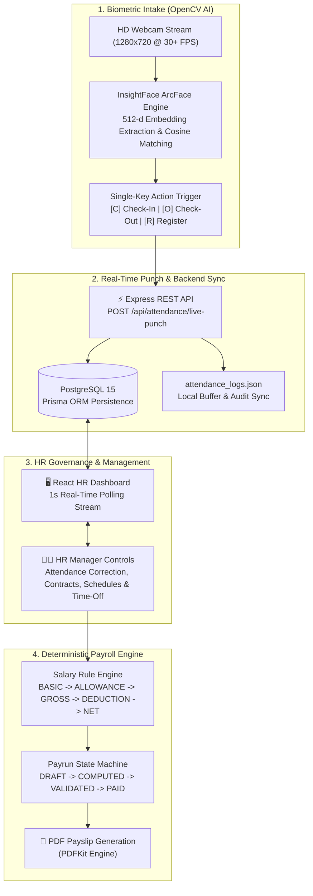
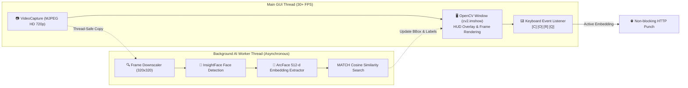
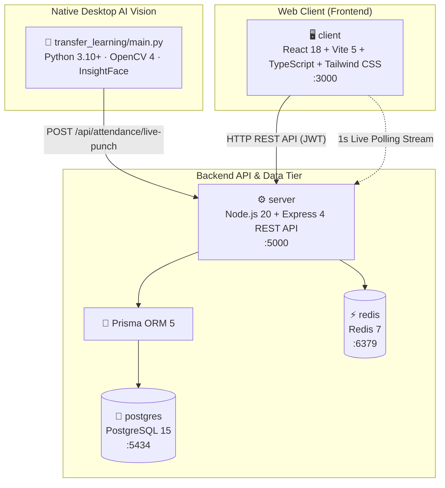
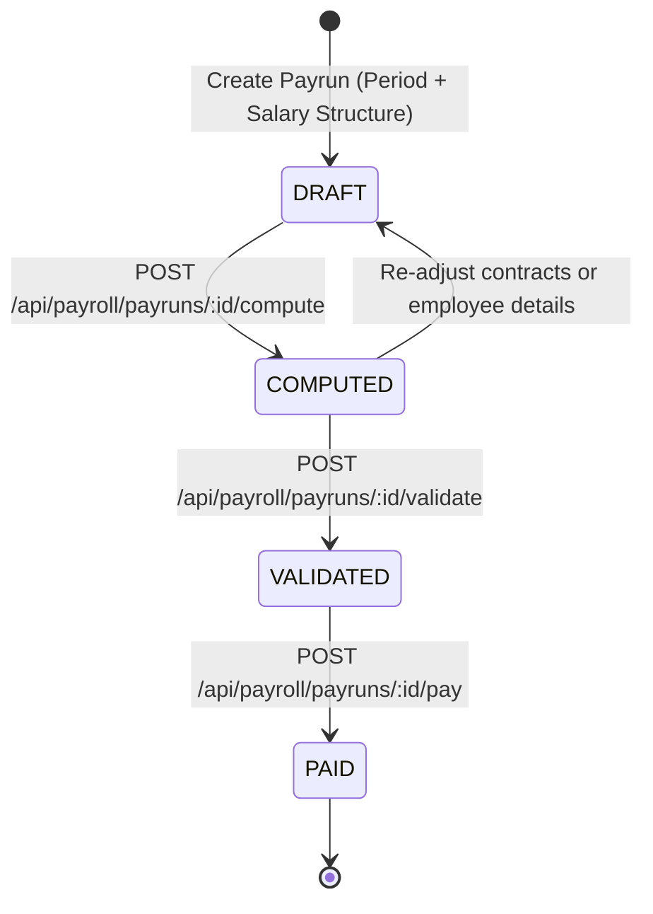
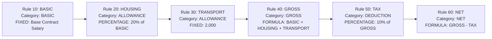
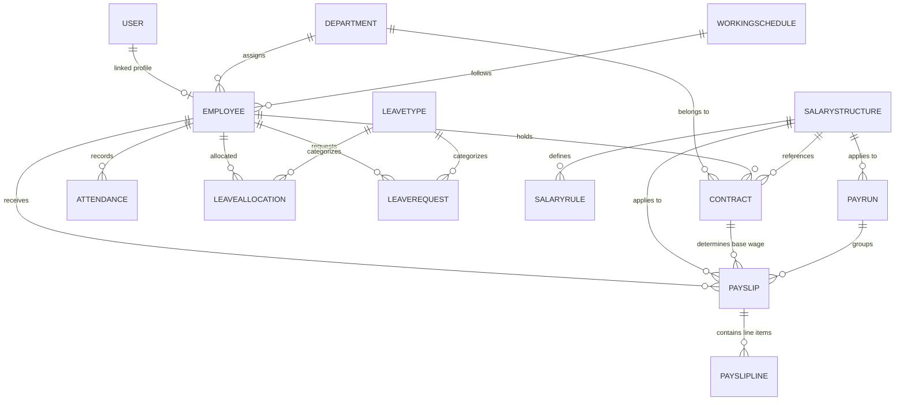

# PeoplePay360 — AI-Powered HR, OpenCV Biometric Attendance & Payroll Platform

> **REAL-TIME OPENCV BIOMETRICS → LIVE PUNCH SYNC → HR GOVERNANCE → CONTRACTS & SCHEDULES → DETERMINISTIC PAYROLL ENGINE**


---

## 🚀 Executive Summary

**PeoplePay360** is a unified, high-performance HR, Attendance, and Payroll platform designed to bridge physical workplace biometric tracking with enterprise HR management and deterministic payroll processing. 

By replacing vulnerable web buttons and proxy-prone badge scanners with an **OpenCV + InsightFace AI facial recognition kiosk**, PeoplePay360 guarantees tamper-proof attendance logging. Biometric check-in and check-out events automatically stream to a central PostgreSQL engine, feeding directly into working-hours calculations, leave balances, HR governance workflows, and multi-tier salary rule engine payruns.

---

## 🎯 Core Problem & Overall Solution Flow

###  Core Problem

Enterprise HR operations suffer from critical vulnerabilities and operational inefficiencies:

1. **Proxy Attendance & Buddy Punching**: Standard web portals, manual clock-ins, or badge swiping permit employees to log attendance for absent colleagues, leading to payroll inflation and inaccurate record-keeping.
2. **Attendance Reconciliation Bottlenecks**: HR teams waste days every month manually collecting attendance logs, matching clock-in times against working schedules, and calculating worked hours, late arrivals, and half-days.
3. **Manual Payroll Calculation Risks**: Multi-tier salary components (basic pay, housing allowances, statutory tax rates, and custom deductions) calculated manually in spreadsheets lead to calculation mistakes, compliance risks, and delayed payslip issuance.
4. **Siloed HR Modules**: Disconnected systems for contracts, working schedules, leave allocations, attendance tracking, and salary rules result in data inconsistencies and lack of real-time visibility.

---

### ✅ Overall Solution Flow

PeoplePay360 resolves these operational gaps through an integrated 7-stage architecture:



1. **Native AI Biometric Intake** 📷 — A multi-threaded Python desktop kiosk uses OpenCV and InsightFace (`buffalo_sc`) to extract 512-dimensional normalized facial feature vectors. Faces are matched against registered profiles via cosine similarity ($ threshold \ge 0.45 $) in under 50ms at 30+ FPS.
2. **Instant Biometric Punch Syncing** ⚡ — Single keypress triggers (`[C]` for Check-In, `[O]` for Check-Out) dispatch non-blocking HTTP payloads to `/api/attendance/live-punch`. Punches calculate worked hours and status (`PRESENT`, `HALF_DAY`, `OVERTIME`) atomically in PostgreSQL.
3. **1-Second Real-Time Web Dashboard Sync** 🖥️ — The React frontend continuously polls biometric logs every 1000ms, providing instant visual feedback on live clock-ins without requiring manual reloads.
4. **Contracts & Working Schedules Alignment** 📜 — Connects base salaries, department assignments, and custom weekly working schedules directly to employee profiles.
5. **Time-Off & Leave Governance** 🏖️ — Accrual balance tracking, leave type management, overlap collision prevention, and manager approval workflows (`PENDING` → `APPROVED` / `REFUSED`).
6. **Deterministic Salary Rule Computation** 💰 — Ordered execution of salary rules (`FIXED`, `PERCENTAGE`, and `FORMULA`) converts gross entitlements into net pay breakdown lines.
7. **Payrun Management & Payslip Export** 📄 — Payruns progress through a strict state machine (`DRAFT` → `COMPUTED` → `VALIDATED` → `PAID`), generating verified PDF payslips for employees.

---

## 🔍 Deep-Dive: OpenCV Native AI Biometric Module

The computer vision engine (`transfer_learning/main.py`) operates as a **high-FPS native desktop application**:



### Key Technical Specs:
- **Asynchronous Multi-Threading**: Separates 1280x720 30+ FPS video capture and rendering from CPU-intensive AI inference to eliminate camera frame stuttering.
- **Model Architecture**: InsightFace `buffalo_sc` ArcFace neural net optimized with a 320x320 detection input size for maximum CPU execution speed.
- **Feature Matching**: L2-normalized 512-dimensional embedding vectors compared using vector dot products (cosine similarity metric).
- **Keyboard Controls**:
  - `[C]` or `[SPACE]`: Instant Biometric Check-In punch.
  - `[O]`: Instant Biometric Check-Out punch.
  - `[R]`: Register / Enroll current face embedding with employee profile details.
  - `[Q]` or `[ESC]`: Close Kiosk application.

---

## 🏗️ System Architecture & Stack



### Component Breakdown

| Layer | Technology | Primary Function |
|---|---|---|
| **AI Vision Kiosk** | Python 3.10+, OpenCV 4.x, InsightFace ArcFace, NumPy | Live webcam video feed, facial detection & recognition, biometric check-in/out triggers, face registration |
| **Frontend** | React 18, Vite 5, TypeScript, Tailwind CSS, Lucide Icons | Real-time attendance dashboard (1000ms polling), HR employee directory, contracts, time-off approvals, payroll views |
| **Backend API** | Node.js 20, Express 4, Prisma ORM 5, Zod | REST API endpoints, live biometric punch handler, authentication (JWT/bcrypt), attendance status calculation, payroll engine |
| **Database** | PostgreSQL 15 | Central persistent database storing users, employees, contracts, schedules, attendance logs, leave balances, payruns, and payslips |
| **Cache & Queue** | Redis 7 | High-speed cache & queue infrastructure |
| **PDF Generation** | PDFKit | Server-side PDF payslip compilation |

---

## 💰 Deterministic Payroll Engine & State Machine

Payruns are executed through a strict state machine to prevent unauthorized calculations or duplicate payouts:



### Salary Rule Calculation Pipeline

Salary rules are evaluated in sequential order based on their assigned `sequence` index:



---

## 🗄️ Database Entity Relationship Diagram (ERD)



---

## 📂 Project Structure

```text
.
├── client/                     # Frontend React + Vite + TypeScript (:3000)
│   └── src/
│       ├── api/                # REST client (attendance, live-punch, employees, payroll)
│       ├── components/         # Reusable UI components & layouts
│       ├── context/            # AuthContext & ToastContext
│       ├── features/           # Attendance, Employees, Contracts, Schedules, TimeOff, Payroll, Admin
│       └── routes/             # Client app routing
│
├── server/                     # Express Backend REST API (:5000)
│   ├── prisma/
│   │   ├── schema.prisma       # Database schema definition (22 models)
│   │   └── seed.js             # Initial database seeder
│   └── src/
│       ├── modules/            # Attendance, Employees, Contracts, Schedules, TimeOff, Payroll, Dashboard
│       ├── middleware/         # Auth, RBAC, Validation, Error Handling
│       └── services/           # AttendanceService, PayrollEngine, PDFService
│
├── transfer_learning/          # Native Python AI Facial Recognition Kiosk
│   ├── main.py                 # Multi-threaded OpenCV + InsightFace ArcFace Engine
│   ├── registered_faces.json   # Face embedding vector database
│   ├── attendance_logs.json    # Local JSON log sync buffer
│   └── requirements.txt        # Python requirements (opencv-python, insightface, numpy)
│
├── docs/                       # Architecture & design specifications
├── docker-compose.yml          # Container configuration (PostgreSQL & Redis)
└── README.md                   # System documentation
```

---

## ⚡ Quick Start Setup Guide

### 1. Launch Database Containers

```bash
docker compose up -d postgres redis
```

---

### 2. Setup & Start Backend Server

```bash
cd server
npm install
cp .env.example .env

# Run Prisma database migrations & seed initial demo data
npx prisma migrate dev
npm run seed

# Launch Express server (runs on http://localhost:5000)
npm run dev
```

---

### 3. Setup & Start Web Client

```bash
cd client
npm install

# Launch React Vite dev server (runs on http://localhost:3000)
npm run dev
```

---

### 4. Launch Native OpenCV AI Biometric Attendance System

Launch the camera directly from the Web UI by clicking **"Launch Live AI Camera"** on the Attendance screen, or launch via terminal:

```bash
cd transfer_learning
pip install -r requirements.txt
python main.py
```

#### ⌨️ Kiosk Controls:
- **`[C]` or `[SPACE]`**: Record Biometric Check-In (POST `/api/attendance/live-punch`)
- **`[O]`**: Record Biometric Check-Out
- **`[R]`**: Enroll / Register Face profile
- **`[ESC]` or `[Q]`**: Quit Kiosk application

---

## 📡 API Reference Summary

All API routes are prefixed with `/api`.

### 📷 Biometrics & Attendance (`/api/attendance`)

| Method | Path | Access | Description |
|---|---|---|---|
| GET | `/attendance/live-opencv-logs` | Public / Kiosk | Fetch real-time biometric attendance log entries |
| POST | `/attendance/launch-camera` | Public / Admin | Execute background process to launch OpenCV Python kiosk |
| POST | `/attendance/live-punch` | Public / Kiosk | Submit real-time biometric check-in / check-out punch |
| POST | `/attendance/check-in` | Authenticated | Manual web Check-In |
| POST | `/attendance/check-out` | Authenticated | Manual web Check-Out |
| GET | `/attendance` | Authenticated | List filtered attendance records |
| PATCH | `/attendance/:id` | HR Roles | HR manual correction of attendance entry |

### 👥 Employees (`/api/employees`)

| Method | Path | Access | Description |
|---|---|---|---|
| GET | `/employees` | HR Roles | List all employee records |
| POST | `/employees` | HR_MANAGER / ADMIN | Create new employee profile |
| GET | `/employees/:id` | Authenticated | Get employee profile details |

### 🏖️ Time Off (`/api/time-off`)

| Method | Path | Access | Description |
|---|---|---|---|
| GET | `/time-off/requests` | Authenticated | List leave requests |
| POST | `/time-off/requests` | Authenticated | Submit new leave request |
| POST | `/time-off/requests/:id/approve` | HR Roles | Approve leave request |
| POST | `/time-off/requests/:id/refuse` | HR Roles | Refuse leave request |

### 💰 Payroll (`/api/payroll`)

| Method | Path | Access | Description |
|---|---|---|---|
| GET | `/payroll/payruns` | HR Roles | List payruns |
| POST | `/payroll/payruns` | HR_PAYROLL_MANAGER | Create payrun |
| POST | `/payroll/payruns/:id/compute` | HR_PAYROLL_MANAGER | Execute salary rules for payrun |
| POST | `/payroll/payruns/:id/validate` | HR_PAYROLL_MANAGER | Validate payrun |
| GET | `/payroll/payslips/:id/pdf` | Authenticated | Download compiled PDF payslip |

---

## 🎬 5-Minute Hackathon Demo Script

1. **Minute 0:00 - 1:00 (Problem & Overview)**:
   Present the PeoplePay360 Dashboard. Explain how proxy attendance and manual payroll reconciliations impact businesses, and outline the unified system flow.
2. **Minute 1:00 - 2:30 (Native OpenCV AI Biometrics)**:
   Click **"Launch Live AI Camera"** from the Attendance screen. Show the native 30+ FPS window detecting face bounding boxes and embeddings. Register a profile with `[R]` and hit `[C]` to Check-In. Show the live camera HUD confirmation.
3. **Minute 2:30 - 3:30 (Real-Time Web Dashboard Sync & HR Governance)**:
   Switch back to the React Attendance page. Show the newly recorded punch appear automatically (via 1s polling stream) with exact timestamps, status (`PRESENT`), and worked-hours tracking. Show HR attendance correction dialogs.
4. **Minute 3:30 - 4:30 (Salary Rules & Payrun Execution)**:
   Navigate to Payroll Payruns. Click **Compute Payrun** and show how ordered salary rules calculate basic wage, allowances, taxes, and net pay.
5. **Minute 4:30 - 5:00 (PDF Payslip Generation & Conclusion)**:
   Open a payslip and download the PDF. Conclude: *"PeoplePay360 delivers zero-proxy biometric tracking seamlessly integrated with enterprise HR management and deterministic payroll."*

---

## 📜 License

**MIT** © Team 49 — Odoo Grand Final Hackathon

*Built with ❤️ by **Team 49** — PeoplePay360*
